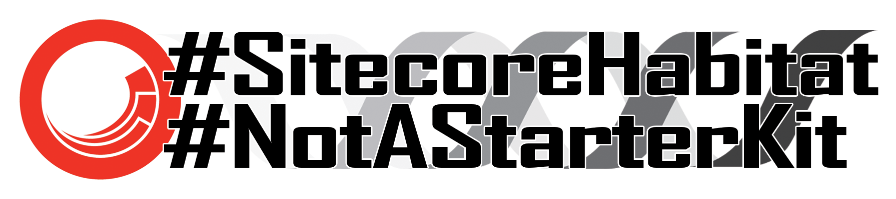

# Stickers from the 2018 Sitecore Symposium and MVP Summit

Another year, some more silly stickers for Symposium and the MVP summit. [The ones from <a href="https://github.com/jermdavis/SymposiumStickers2017">last year are here</a>]

The files are available in Photoshop format, and as PNGs below.
They're under an "<a href="http://creativecommons.org/licenses/by-sa/4.0/">attribution, share-alike</a>" license so if you've got customisations you'd like to make, go ahead.
Just give the artwork back to the community and link back to this repo.

For Symposium, I used <a href="https://www.stickermule.com/uk/custom-stickers">Sticker Mule</a> to print copies of these, and the quality was great.
It's a bit hidden, but they also have <a href="https://www.stickermule.com/samples/stickers">an "order samples" option</a>, which lets you get smaller numbers if you only need a few (or to check out your designs).

## General stickers

1. **Bobby Hack Pwned Your Password** 
     
    [<a href="Hack.psd">PSD File</a>]

2. **xConnExpert** 
     
    [<a href="xConnExpert.psd">PSD File</a>]

3. **Angel** 
     
    [<a href="Angel.psd">PSD File</a>]

4. **Not a starter kit (Circular)** 
     
    [<a href="NotAStarterKit-Circle.psd">PSD File</a>]

5. **Not a starter kit [Two lines]** 
     
    [<a href="NotAStarterKit-TwoLine.psd">PSD File</a>]

----

Logos used here belong to their respective companies.

----

 This work is licensed under a <a rel="license" href="http://creativecommons.org/licenses/by-sa/4.0/">Creative Commons Attribution-ShareAlike 4.0 International License</a>.